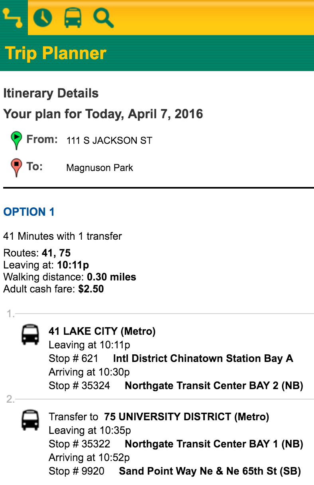

# TripShark: Transit Performance Portal

Miles Erickson
April 7, 2016

## Project Description

The Seattle area has many hundreds of bus routes in addition to multiple ferry routes and rail lines. Automated trip planning software helps transit riders navigate the transit system. Such software can recommend the fastest scheduled route between a given origin and destination at a given time of day. However, buses often run late. Existing trip planning tools do not account for the variance in actual arrival times due to traffic conditions.

This project proposes to address this issue by providing new tools for transit planners and for transit riders:

* Detailed statistics on scheduled vs. actual transit arrival times at any location in King County.

* Graphs of expected vs. actual travel times and missed connections on simulated trips at different times of day throughout the week.

* A trip planning tool that includes the predicted reliability of any recommended transfer connections.

# Project Plan

The proposed project is divided into phases according to [CRISP-DM](https://en.wikipedia.org/wiki/Cross_Industry_Standard_Process_for_Data_Mining):

## Phase 1: Business Understanding

Current trip planning software generates trip plans involving transfers based solely on <i>scheduled</i> arrival and departure times. It does not use archived data or statistics to predict <i>expected</i> arrival and departure times, nor does it assess the <i>reliability</i> of recommended transfer connections.

An example of a trip plan is shown below. Generated by the <a href="tripplanner.kingcounty.gov/">King County Metro Trip Planner</a> web site, this shows the fastest scheduled route between Pioneer Square and Magnuson Park (in Northeast Seattle) at 10:00 p.m. on a weekday. Note that the trip involves catching a bus that is scheduled to arrive at Northgate Transit Center at 10:30 pm, then transferring to a bus that departs from that location five minutes later at 10:35 pm:

### Existing Conditions
* Currently, recommended transfer connections are based solely on <i>scheduled</i> arrival and departure times. The trip planner knows that the 41 is <i>scheduled</i> to arrive 5 minutes before the 75 in <i>scheduled</i> to leave. It does not know whether the 41 is <i>expected</i> to arrive before the 75 leaves.
* Real-time vehicle location data is available via [Tracker](http://tripplanner.kingcounty.gov/hiwire?.a=iRealTimeDisplay) and [OneBusAway](http://pugetsound.onebusaway.org/where/standard/), but neither service provides archival on-time performance data.

### Sample Questions
* How often does the 41 actually arrive in time to make the transfer connection to the 75 at Northgate Transit Center?
* On average, what percentage of transit trip plans result in an on-time arrival?
* How many minutes of delay do riders experience on average?
* Do these percentage vary according to day of week, time of day, etc.?

### Opportunities
* Real-time vehicle location data is available to developers.
* The OneBusAway project provides open-source code that interprets this real-time location data and translates it into projected bus arrival times at any bus stop.
* Schedule deviations should be predictable to some extent. For example, the Friday afternoon bus schedule is the same as the Monday afternoon bus schedule, but freeway congestion is most severe on Friday afternoons.
* The use of archived vehicle location data should enable predictions about the reliability of transit connections.

## Phase 2: Data Understanding

The following data sources are available for this project:
* [GTFS Data](http://www.soundtransit.org/Developer-resources/Data-downloads) representing transit routes, bus stop locations, and scheduled trips.
* [OneBusAway Real-Time API](http://developer.onebusaway.org/modules/onebusaway-application-modules/1.1.14/api/where/index.html) showing the real-time locations of all transit vehicles. (Note: I already have a OneBusAway API key.)
* [Archival GTFS-realtime data](https://groups.google.com/forum/#!topic/onebusaway-api/NMb0FQozqyU) showing historical vehicle locations.

### Data Understanding Milestones

| Task | Deadline | Status
| ---- | -------- | --------
| Download Puget Sound GTFS data | 2016-04-08&nbsp;(Friday) | Completed
| Obtain OneBusAway API Key | 2016-04-08&nbsp;(Friday) | Completed
| Test OneBusAway API queries via `requests.get()` | 2016-04-08 (Friday) | Completed |
| Review OneBusAway code and documentation in detail | 2016-04-08 (Friday) |

## Phase 3: Data Preparation

This phase involves converting raw data into a format that is useful for our analysis. This will involve creating a potentially large archival dataset to be stored on Amazon Web Services for subsequent analysis.

Crucial to this phase is the prior art embodied in the open-source [OneBusAway](https://github.com/OneBusAway) project, which provides the machinery to ingest real-time vehicle location data and convert it into projected and actual arrival times at any bus stop.

Key questions:
* How large would the dataset become if it included arrival times for every trip at every stop?
* If this would be too large, would it be preferable to subset the data by sub-region or by transfer points?

### Data Preparation Milestones

| Task | Deadline | Status
| ---- | -------- | ------
| Begin collecting GTFS-realtime data at 1-minute intervals (stored on AWS)  | 2016-04-08 (Friday)
| Setup OneBusAway REST API | 2016-04-11 (Monday)
| Build pipeline: transform GTFS-realtime data into actual arrival times at each bus stop | 2016-04-12 (Tuesday)
| Build pipeline: transform online trip plans into lists of (trip ID, origin stop ID, destination stop ID) | 2016-04-13 (Wednesday)

## Phase 4: Modeling

This phase will require development of an algorithm to predict expected bus arrival times and to predict the reliability of transit trips.

### Potential deliverables

* *Trip generation model*: A function to generate random, plausible trip plan requests within King County, submit them to the Trip Planner, and return the recommended trip plan.
* *Replay simulation model*: An algorithm to retroactively assess the reliability of any given transit trip plan via simulation ("replaying" historical transit data to predict minutes of delay and how frequently a connection is successful)
* *Predictive model*: A machine learning algorithm to prospectively predict the expected minutes of delay for a particular transit trip arriving at a given location. Input features may include features such as day of week, past performance of prior trips on the same bus route, and generalized traffic congestion data (if available).

### Modeling Milestones

| Task | Deadline | Status
| ---- | -------- | ------
| Trip generation model | 2016-04-13 (Wednesday) |
| Replay simulation model | 2016-04-14 (Thursday) |
| Predictive model | 2016-04-15 (Friday) |

## Phase 5: Evaluation

This phase provides an opportunity to assess the results of the Modeling phase and determine their suitability for use in fulfilling the business objectives. I propose to involve Ming directly in this process via a scheduled one-on-one review session.

### Evaluation Milestones

| Task | Deadline | Status
| ---- | -------- | ------
| Review models & deployment plan in one-on-one meeting with Ming | 2016-04-15 (Friday) |

## Phase 6: Deployment

In the deployment phase, I expect to deliver a web site at http://tripshark.net/ including the following:

* Statistics on average trip reliability and average trip delay throughout the day and week, calculated by running simulations of numerous hypothetical trip plans using the trip generation model and replay simulation model.

* Visualizations showing simulated trip plans and the extent of their deviation from scheduled travel times. At minimum, this would consist of a slide deck explaining how the models work.

* A web application enabling a user to request a trip plan including both scheduled and expected arrival times, and a prediction of the trip's reliability based on the distribution of prior trips' arrival and departure times.

### Deployment Milestones

| Task | Deadline | Status
| ---- | -------- | ------
| Trip reliability statistics | 2016-04-18 (Monday) |
| Basic web application (functional/unstyled) | 2016-04-19 (Tuesday)
| Simulated trip plan visualizations | 2016-04-20 (Wednesday) |
| Pretty web application (templates/graphs) | 2016-04-21 (Thursday) |

## Risks/Challenges

* Vehicle location data is missing for a significant proportion of bus trips (at least 10%) due to problems with the proprietary equipment used to track and report vehicle locations. This will result in data gaps that will require imputation.

* I will need to make use of the existing [OneBusAway REST API](http://developer.onebusaway.org/modules/onebusaway-application-modules/current/api/where/index.html) code base in order to build the proposed data pipeline. This code base is well-documented, including detailed setup instructions, but it is possible that I will encounter unforeseen challenges in its deployment. (Obviously, experience gained in my past life as a systems engineer is essential to this part of the project.)

* This project will generate a potentially large amount of data to be stored and queried on AWS. I will need to make careful and deliberate decisions about how to store and manage this data. I expect that I will need to think carefully about how databases are stored and indexed to provide for adequate capacity and performance.
