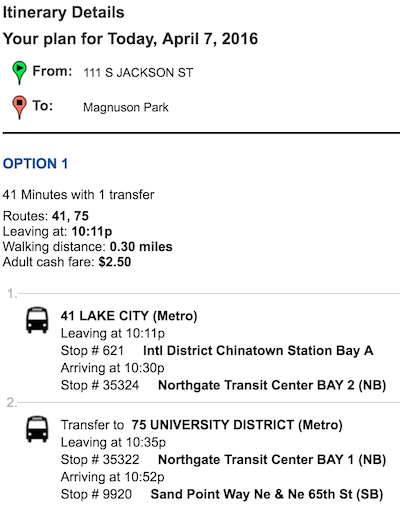

# TripShark: Transit Performance Revealed

Miles Erickson
April 7, 2016

## Project Description

The Seattle area has many hundreds of bus routes in addition to multiple ferry routes and rail lines. Automated trip planning software helps transit riders navigate the transit system. Such software can recommend the fastest scheduled route between a given origin and destination at a given time of day.

An example of a trip plan is shown below. Generated by the <a href="tripplanner.kingcounty.gov/">King County Metro Trip Planner</a> web site, this shows the fastest scheduled route between Pioneer Square and Magnuson Park (in Northeast Seattle) at 10:00 p.m. on a weekday. Note that the trip involves catching a bus that is scheduled to arrive at Northgate Transit Center at 10:30 pm, then transferring to a bus that departs from that location five minutes later at 10:35 pm:

### Existing Conditions
* Currently, recommended transfer connections are based solely on <i>scheduled</i> arrival and departure times. The trip planner knows that the 41 is <i>scheduled</i> to arrive 5 minutes before the 75 in <i>scheduled</i> to leave. It does not know whether the 41 is <i>expected</i> to arrive before the 75 leaves.
* Real-time vehicle location data is available via [Tracker](http://tripplanner.kingcounty.gov/hiwire?.a=iRealTimeDisplay) and [OneBusAway](http://pugetsound.onebusaway.org/where/standard/), but neither service provides archival on-time performance data.

### Sample Questions
* How often does the 41 actually arrive in time to make the transfer connection to the 75 at Northgate Transit Center?
* On average, what percentage of transit trip plans result in an on-time arrival?
* How many minutes of delay do riders experience on average?
* Do these percentage vary according to day of week, time of day, etc.?

### Opportunities
* Real-time vehicle location data is available to developers.
* The OneBusAway project provides open-source code that interprets this real-time location data and translates it into projected bus arrival times at any bus stop.
* Schedule deviations should be predictable to some extent. For example, the Friday afternoon bus schedule is the same as the Monday afternoon bus schedule, but freeway congestion is most severe on Friday afternoons.
* The use of archived vehicle location data should enable predictions about the reliability of transit connections.

# Project Plan

The proposed project is divided into phases according to [CRISP-DM](https://en.wikipedia.org/wiki/Cross_Industry_Standard_Process_for_Data_Mining):

## Phase 1: Business Understanding

Current trip planning software generates trip plans involving transfers based solely on <i>scheduled</i> arrival and departure times. It does not use archived data or statistics to predict <i>expected</i> arrival and departure times, nor does it assess the <i>reliability</i> of recommended transfer connections.

## Phase 2: Data Understanding

The following data sources are available for this project:
* [GTFS Data](http://www.soundtransit.org/Developer-resources/Data-downloads) representing transit routes, bus stop locations, and scheduled trips.
* [OneBusAway Real-Time API](http://developer.onebusaway.org/modules/onebusaway-application-modules/1.1.14/api/where/index.html) showing the real-time locations of all transit vehicles. (Note: I already have a OneBusAway API key.)
* [Archival GTFS-realtime data](https://groups.google.com/forum/#!topic/onebusaway-api/NMb0FQozqyU) showing historical vehicle locations.

### Data Understanding Milestones

| Task | Deadline | Status
| ---- | -------- | --------
| Download Puget Sound GTFS data | 2016-04-08 (Friday) | Completed
| Obtain OneBusAway API Key | 2016-04-08 (Friday) | Completed
| Test OneBusAway API queries via requests.get() | 2016-04-08 (Friday) | Completed

## Phase 3: Data Preparation

This phase involves converting raw data into a format that is useful for our analysis. This will involve creating a potentially large archival dataset to be stored on Amazon Web Services for subsequent analysis.

### Data Preparation Milestones

| Task | Deadline | Status
| ---- | -------- | ------
| Begin collecting GTFS-realtime data at 1-minute intervals (stored on AWS)  | 2016-04-08 (Friday)
| Build pipeline for transforming GTFS-realtime data into actual arrival times at each bus stop | 2016-04-12 (Tuesday)

## Phase 4: Modeling

## Phase 5: Evaluation

## Phase 6: Deployment

In this phase of the project, I will

### Deployment Milestones

An algorithm to predict the reliability of any given transit trip plan. This could be done via simulation ("replaying" historical transit data to predict the trip's reliability) and/or predictive modeling.

* Statistics on average trip reliability and average trip delay throughout the day and week, calculated by running simulations of hypothetical trip plans.

* Visualizations showing simulated trip plans and the extent of their deviation from scheduled travel times.

* A web application enabling a user to get a trip plan including both scheduled and expected arrival times, and a prediction of the trip's reliability based on the distribution of prior trips' arrival and departure times.
